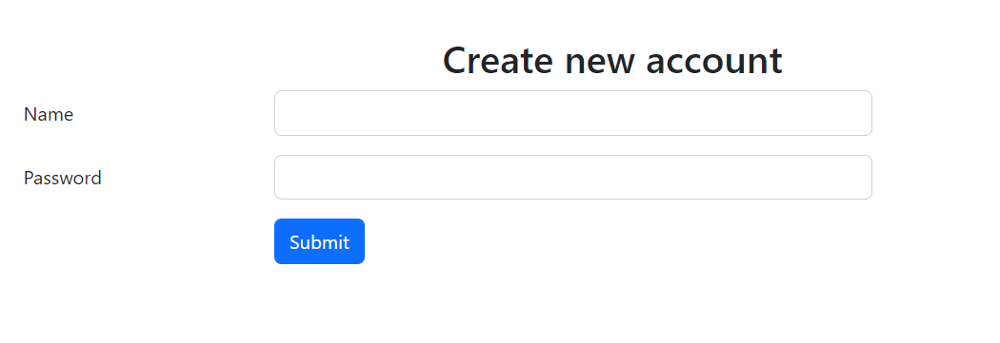
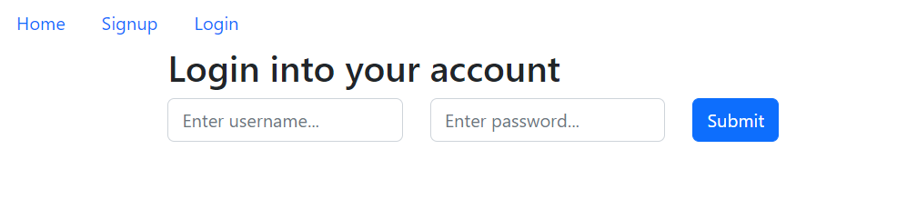
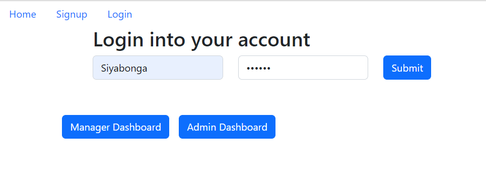
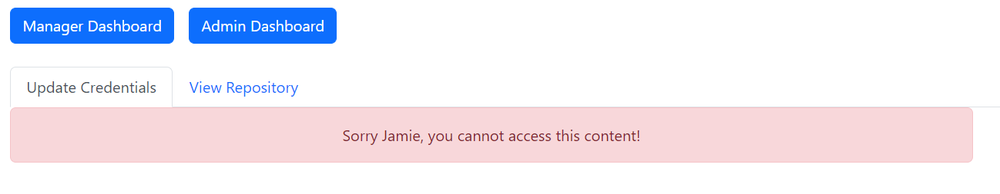
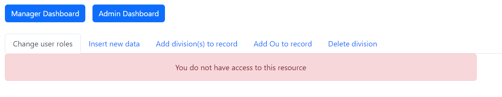
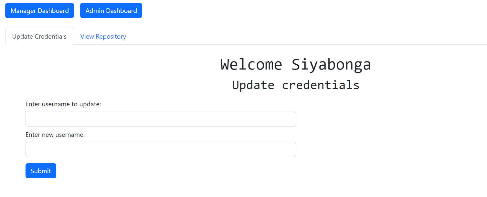
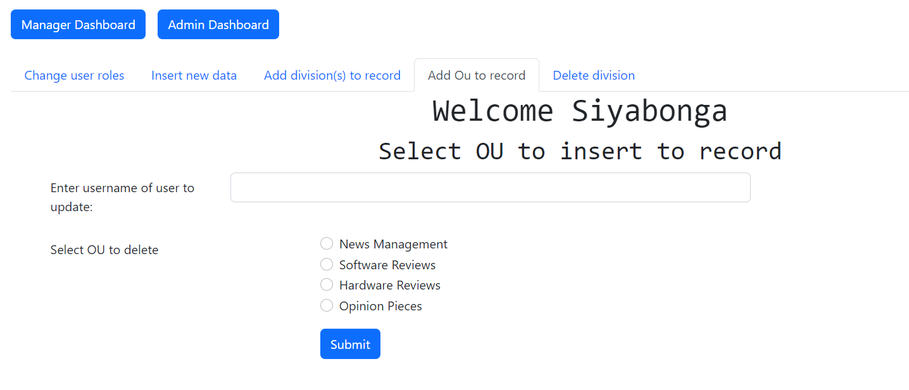

# CoolTech

This is an express app that communicates to a mongodb database using mongoose models. The information is then passed to the frontend that is create using react, and communicates to the express backend using a proxy server.

# Description

This is a program is modelled after a private company web app, that handles employees credentials - username & password - and verifies their identities and their permissions before giving access to say, admin or mangerial resources. To validate and give access to user resources, the employees permissions is verified using `jwt_verification`.

# Installation

To install this program, simply go to the directory this project is located and type:
```cmd
npm install
```
Than go into the directory `frontend` which is one of this projects folders and again type:
```cmd
npm install
```
This will install the `node_modules` file for the react app, and the former command with download the `node_modules` file for the express app.

# Usage

Depending on which link you wish to use for the express app, search the ***app.js*** file `app.listen` function and change the port number to the number you wish to use. However, if you choose to change the port number of the express app, you have to open the `package.json` file in the frontend file for the react files, and change the proxy port number to the correct react app port.

To run the projects, open both the frontend folder and the directory you place the project files and type:
```cmd
npm start
```
To run both these projects. If the express app is correctly running, 'Server started' should be printed to the console. The react app will immediately open your default browser. I would highly advise that you first begin by starting the express app before the react app. This is because the react app is dependant on the express app to run perfectly.

# Running the program

If the program is running successfully the program should do this...

To signup to the database the screen below should display to you. Be sure to click the `signup` link in the top navigation bar


To login to the database, the following screenshot should appear - cick the `login` button link in the navigation bar


If the user is not successfully logged in the message below should display:
```
Username or password entered is not valid.
```

But if successfully logged in the screenshot page should display this render



If the user is registered as a normal user, the following screenshots should be displayed, with restrictive messages showing that the user cannot access the content.

#### Manager restriction


#### Admin restriction


If however the have access to both these resources, the screen should render the following screen for..

#### Manager


#### Admin


# Additional information

In the `app.js` file, remove the comments in the mongodbConnector() function and add the link to your mongodb database.

For how to model your database, check the models folder and the file in it to see the correct mongoose model.
